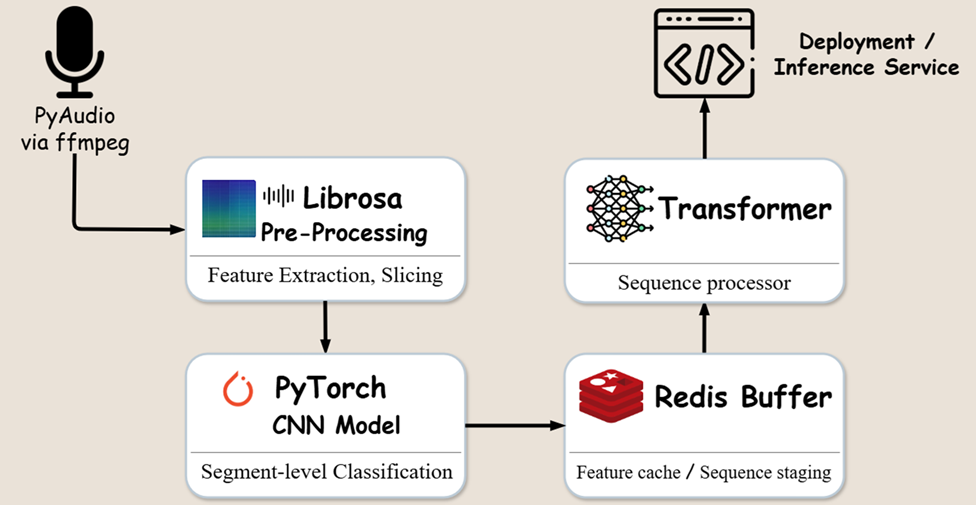

# GUARD — General Urban Audio Recognition & Defense

**Slogan:** GUARD: The City Never Sleeps, Neither Do We.  
**中文:** 通用城市音訊辨識與防禦系統 — 守護與防禦，強調安全性與可靠性，給政府與公眾強烈信賴感。

> 兩階段聲音事件偵測（Two-Stage SED）：輕量 CNN 做邊緣偵測，Transformer/CRNN 做時序精煉，支援即時公共安全警報（槍響、玻璃破裂、尖叫等）。
- Streamlit:https://aiotda-finalpro-guard-group10.streamlit.app/
---

## 目錄
- [核心定位](#核心定位)
- [架構概覽](#架構概覽)
- [快速開始](#快速開始)
- [Streamlit 互動 Demo](#streamlit-互動-demo)
- [範例音檔](#範例音檔)
- [Stage-1 訓練腳本](#stage-1-訓練腳本)
- [監控與警報策略](#監控與警報策略)
- [安全與隱私](#安全與隱私)
- [後續路線](#後續路線)
- [Specification-Driven Development](#specification-driven-development)

## 核心定位
- **守護與防禦**：強調安全性、可靠性、低誤報，適用政府/公共安全場景。
- **雙階段偵測**：Stage-1 高召回低延遲；Stage-2 時序精煉降誤報。
- **抗噪設計**：PCEN、頻段遮罩、SpecAugment、背景自適應。
- **可觀測性**：事件計數、延遲、Redis 深度、丟包率、誤報/漏報率。

## 架構概覽


- **Source**：PyAudio via ffmpeg — 麥克風串流、滑動窗切片。
- **Pre-Processing**：Librosa (Log-Mel/PCEN)。
- **Stage-1**：輕量 CNN 邊緣偵測（高召回）。
- **Buffer**：Redis 暫存特徵 / logits，供序列模型拉取。
- **Stage-2**：Transformer/CRNN 序列精煉（降誤報、提升定位）。
- **Service**：推論/警報 API，健康檢查與指標導出。

<details>
<summary>技術堆疊（展開）</summary>

- Python 3.10+，PyTorch 2.x，Librosa，Streamlit
- ffmpeg、PyAudio（可選，若用麥克風）
- Redis（可選，用於生產緩衝）
- TorchScript/ONNX 導出（便於部署）
</details>

## 快速開始
1) 建立虛擬環境並安裝相依（建議 Python 3.11；Streamlit Cloud 可用 `runtime.txt` 指定）
```bash
python -m venv .venv
.\.venv\Scripts\activate
pip install --upgrade pip
pip install -r requirements.txt   # Python 3.11 下會安裝 torch==2.3.1；3.13 會略過 torch
```
2) 確認 ffmpeg 在 PATH（若使用麥克風/轉檔）。

> 如需訓練或接入 Torch 模型，請使用 Python 3.10–3.12（建議 3.11）並安裝：`pip install -r requirements-train.txt`

## Streamlit 互動 Demo
- 執行：`streamlit run app.py`
- 頁面標題即顯示 GUARD Slogan：**“GUARD: The City Never Sleeps, Neither Do We.”**
- 側邊欄可調整：
  - 取樣率、frame/hop
  - Stage-1 閾值（敏感度）
  - Stage-2 平滑/最小事件長度、類別映射
  - 頻譜圖顯示、CSV 下載開關
- 主區塊：
  - 階段 1/2 偵測結果表格（可下載 CSV）
  - 頻譜視覺化
  - 如何替換為真實模型的說明

詳見 `STREAMLIT.md`。

## 範例音檔
- 產生（已生成）：
```bash
python scripts/generate_sample_audio.py
```
- 目錄：`samples/`
  - `demo_gunshot_glass.wav`（合成槍響+玻璃破裂）
  - `demo_noise.wav`（環境噪音）
- 上傳到 Streamlit 介面即可測試，或用於自建資料集。

## Stage-1 訓練腳本
- 模型：`src/models/baseline_cnn.py`（輕量 CNN，輸入 `(B,1,MELS,T)`）。
- Dataset 包裝：`src/train/dataset.py`（讀取 `.npz`，keys: `feat`, `label`）。
- 訓練腳本：`src/train/train_cnn.py`
```bash
python -m src.train.train_cnn --data-dir data_npz --num-classes 2 --epochs 5 --batch-size 16
```
- 輸出：`checkpoints/stage1_cnn.pt`（可 TorchScript/ONNX 導出後嵌入 app）。
- 詳細步驟與特徵示例：`TRAINING.md`。

## 監控與警報策略
- 指標：`event_count{class=...}`、`latency_ms{stage=...}`、`redis_depth`、`drop_ratio`、`false_alarm_rate`。
- 健康檢查：ffmpeg/PyAudio 可用性、Redis 連線、模型載入、推論耗時。
- 警報：Webhook/SMS/Email，含冷卻時間與去抖動；同類事件合併。

## 安全與隱私
- 僅保存必要片段，限制存留時間與存取權限。
- 傳輸加密（HTTPS/TLS），告警管道需驗證/簽名。
- 防濫用：速率限制、IP/裝置白名單、角色權限。

## 後續路線
- 導入真實 Stage-2 Transformer/CRNN，接 Redis 緩衝。
- 事件定位/SELD 與麥克風陣列支援。
- 量化/剪枝優化邊緣部署；增加自動標註與半監督訓練。
- 新增自動化測試：延遲、誤報率、穩定性 smoke tests。

## Specification-Driven Development
- 主要規格、接受準則、NFR、測試策略請參考 `docs/SPECIFICATION.md`（SDD 文檔）。
